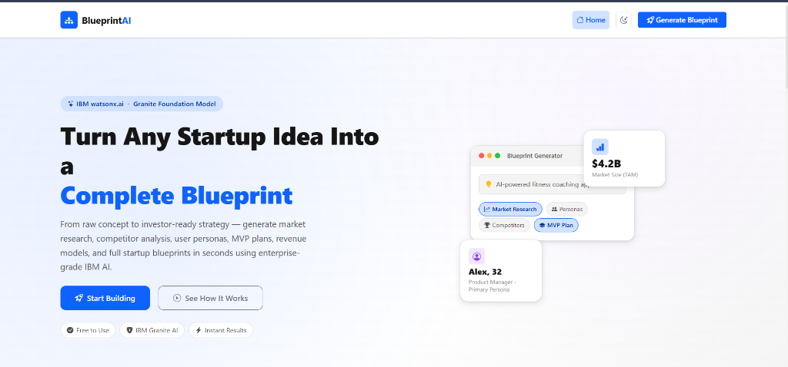
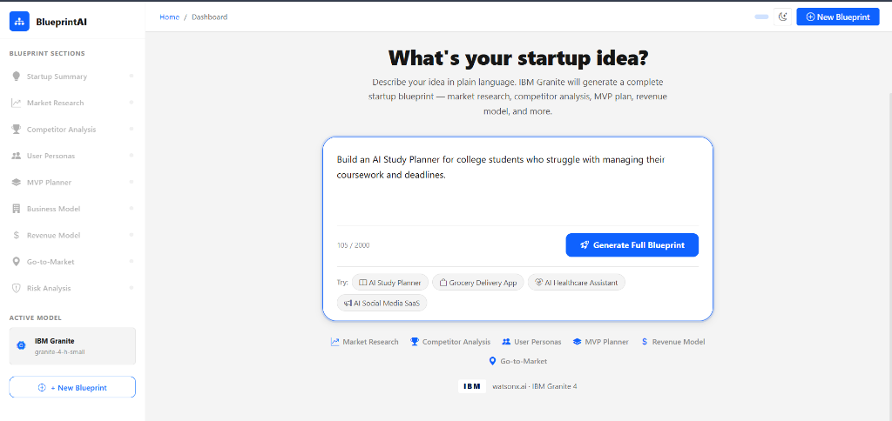
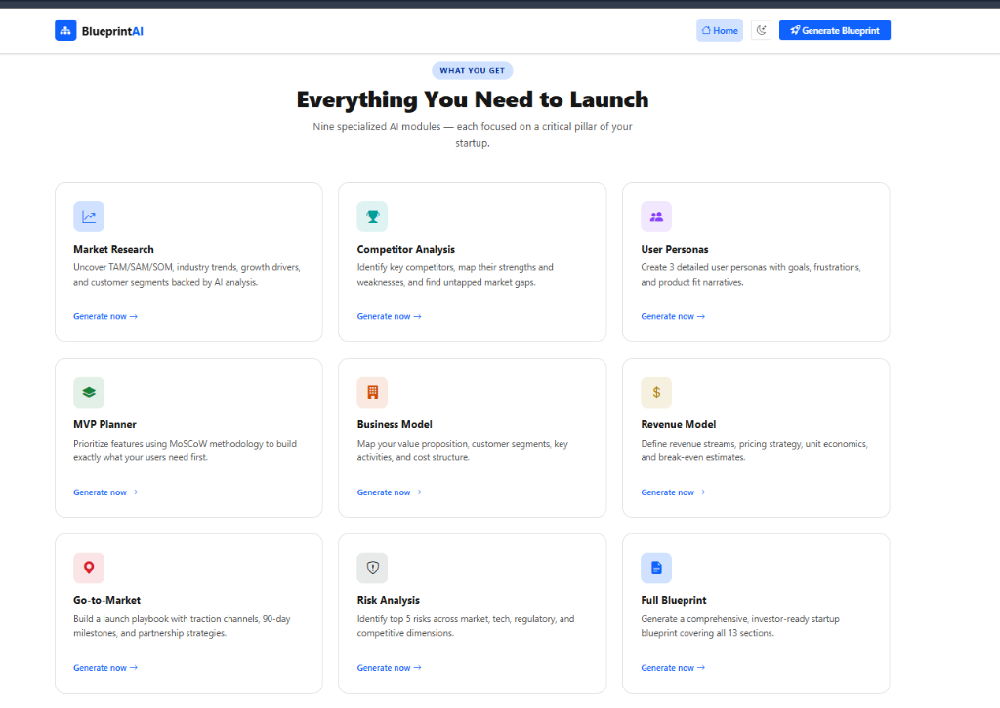
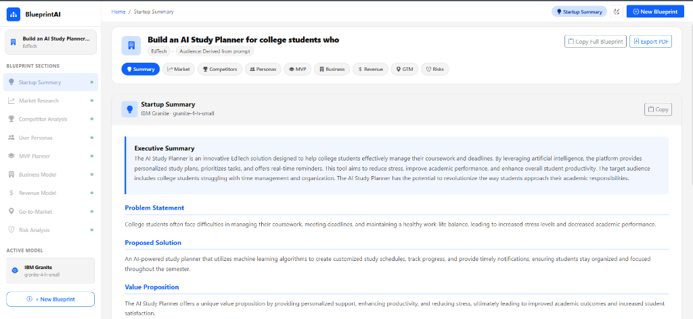
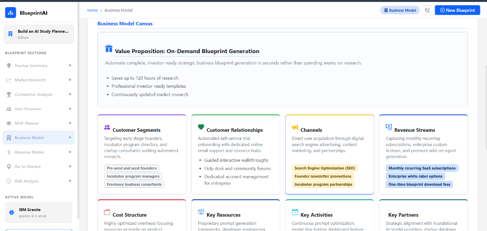

# 🚀 BlueprintAI — AI-Powered Startup Blueprint Generator

[](https://www.python.org/)
[](https://flask.palletsprojects.com/)
[](https://www.ibm.com/watsonx)
[](LICENSE)
[](#)

BlueprintAI is a high-performance, developer-friendly startup planning assistant powered by **IBM's Granite foundation models** via the **IBM watsonx.ai API**. It translates raw business ideas into structured, investor-ready startup blueprints — complete with market sizing calculations, competitor positioning, target personas, roadmaps, financials, and risk mitigation strategies.

## 🎥 Live Demo

- **🔗 LinkedIn Demo Video**: https://www.linkedin.com/posts/rishikasri_ibm-ibmskillsbuild-aicte-ugcPost-7481041068407504897-RifQ/?utm_source=share&utm_medium=member_desktop&rcm=ACoAAGRJ1NEBUdn5Ib86LVwKJYtGxljZszVpwQQ

> [!NOTE]
> We highly encourage visitors to watch the live demo video to understand the complete user workflow, features, and real-time generation capabilities of BlueprintAI before exploring the source code.

---

## 📌 Problem Statement

Entrepreneurs and early-stage founders often struggle to convert raw ideas into structured, data-backed business models. Standard planning workflows require:
- Complex market size estimations (**TAM / SAM / SOM**).
- Multi-dimensional target user profiling.
- Rigorous competitor positioning and risk mitigation mapping.

Traditional business planning takes weeks of manual research. General-purpose AI models often return generic, unstructured advice that lacks context, cross-module consistency, or region-specific formatting.

---

## 💡 Solution Overview

**BlueprintAI** automates the entire ideation-to-execution pipeline using a structured, multi-module orchestration architecture:
1. **Interactive Ingestion**: A responsive terminal UI collects the initial startup prompt.
2. **Clarification Loop**: If the startup idea is too brief or ambiguous, the agent pauses to ask smart, context-driven follow-up questions to refine the inputs.
3. **Structured Module Planning**: Coordinates 9 specialized business modules, enforcing strict data schemas to generate consistent, interconnected business report cards.
4. **Rich Visual Dashboard**: Renders calculations, growth forecasts, competitor matrices, and personas in an elegant, theme-responsive dashboard with a seamless dark-mode toggle and clean print-to-PDF support.

---

## ✨ Key Features

- **9 Domain-Specific Analysis Modules**:
  - **Market Research**: TAM / SAM / SOM calculator and market segment distribution charts.
  - **Competitor Analysis**: Positioning tables, differentiators, and threat matrices.
  - **User Personas**: Rich customer profiles with custom avatars, motivations, and pain points.
  - **MVP Features**: Product roadmap prioritized using MoSCoW categorization.
  - **Business Model Canvas**: Value proposition, channels, key partners, and resource structures.
  - **Revenue Model**: 3-year growth metrics and dynamic progress charts.
  - **Go-To-Market (GTM)**: Channels, launch phases, and user acquisition timelines.
  - **Risk Analysis**: Structured impact/probability risk matrices.
  - **Executive Summary**: Comprehensive, cohesive high-level overview.
- **Smart Clarifying Agent**: Interactively prompts users for target audience, geography, or business model detail when inputs are underspecified.
- **Resilient AI SDK Client**: Detects regional endpoint capabilities (e.g., London `eu-gb` region model sets) and automatically falls back to supported models (like `meta-llama/llama-3-3-70b-instruct`) rather than failing.
- **Premium CSS/JS UI**: A modern dashboard utilizing custom color tokens, hover micro-animations, collapsible sidebars, and an automatic theme system.

---

## 🏛️ System Architecture

BlueprintAI separates API routing, AI prompt orchestration, and frontend rendering for high modularity:

```
                  ┌──────────────────────────────┐
                  │      User Web Browser        │
                  │  (HTML5 / ChartJS / Theme)   │
                  └──────────────┬───────────────┘
                                 │
                     (REST / NDJSON Streaming)
                                 ▼
                  ┌──────────────────────────────┐
                  │      Flask App Server        │
                  │         (app.py)             │
                  └──────────────┬───────────────┘
                                 │
                   (Prompt/Context Orchestration)
                                 ▼
                  ┌──────────────────────────────┐
                  │     IBM watsonx.ai Agent     │
                  │         (agent.py)           │
                  └──────────────┬───────────────┘
                                 │
                    (Secure eu-gb Regional HTTPS)
                                 ▼
                  ┌──────────────────────────────┐
                  │      IBM Watsonx Cloud       │
                  │   (Granite / Llama Model)    │
                  └──────────────────────────────┘
```

---

## ⚙️ Tech Stack

* **Backend**: Python 3.9+, Flask, dotenv, Gunicorn, `ibm-watsonx-ai` SDK
* **Frontend**: Vanilla ES6 JavaScript, Chart.js (Dynamic Data Visualizations), Marked.js (Markdown parsing), Bootstrap 5.3.3, Bootstrap Icons
* **Aesthetics**: Premium Custom CSS variables, responsive typography, and system-synchronized dark mode variables.

---

## 🧠 AI Workflow & Schema Enforcement

To prevent the LLM from outputting unstructured markdown or irrelevant details:
1. **Module Prompt Isolation**: Each module uses a specific, isolated prompt containing strict system rules.
2. **Strict Context Constraints**: Custom project rules (`AGENTS.md`) prevent the model from introducing outside industries or placeholder data.
3. **Structured Parsers**: RegEx engines parse output JSON tokens and inject styled DOM cards, charts, and lists dynamically.

---

## 📁 Folder Structure

```
startup-blueprint-generator/
├── app.py                      # Flask routes, NDJSON streaming, and API endpoints
├── agent.py                    # IBM watsonx.ai client, model fallbacks, and prompts
├── requirements.txt            # Python environment dependencies
├── .env.example                # Configuration template for credentials
├── .gitignore                  # Git exclusions (.env, virtual envs, caches)
├── README.md                   # Project documentation
├── static/
│   ├── css/
│   │   └── style.css           # Core styling and theme configuration
│   ├── js/
│   │   ├── dashboard.js        # Module render engines, API calls, and charts
│   │   ├── landing.js          # Landing page animations
│   │   └── theme.js            # Dark mode preference manager
│   └── images/
│       └── media__*.png        # Visual screenshots and design mocks
└── templates/
    ├── base.html               # Main layout and navbar template
    ├── index.html              # Landing page
    ├── dashboard.html          # Main application workspace
    └── 404.html                # Custom 404 handler page
```

---

## 🛠️ Installation & Local Development Setup

### 1 — Clone the Repository
```bash
git clone https://github.com/yourusername/blueprint-ai.git
cd blueprint-ai
```

### 2 — Configure Virtual Environment
```bash
# Windows
python -m venv venv
venv\Scripts\activate

# macOS / Linux
python3 -m venv venv
source venv/bin/activate
```

### 3 — Install Dependencies
```bash
pip install -r requirements.txt
```

### 4 — Configure Environment Variables
Copy the template file:
```bash
cp .env.example .env
```
Open `.env` and fill in your IBM watsonx.ai credentials:
```env
WATSONX_API_KEY=your_ibm_cloud_api_key_here
WATSONX_PROJECT_ID=your_watsonx_project_id_here
WATSONX_URL=https://eu-gb.ml.cloud.ibm.com
WATSONX_MODEL_ID=ibm/granite-4-h-small
FLASK_SECRET_KEY=change-me-to-a-random-string
FLASK_ENV=development
FLASK_PORT=5000
FLASK_DEBUG=true
```

### 5 — Run the Application
```bash
python app.py
```
Open your browser and navigate to: **`http://localhost:5000`**

---

## 📝 Example User Prompt

```text
I want to build a smart B2C subscription app called 'EcoTrack' that helps households reduce their carbon footprint by scanning grocery receipts and suggesting low-carbon food alternatives.
```

---

## 📊 Sample Output (Structured JSON Payload)

```json
{
  "success": true,
  "module": "market_research",
  "content": {
    "market_overview": "The carbon management software market is growing rapidly...",
    "tam": "$12.4 Billion",
    "tam_description": "Global carbon reduction app addressable market by 2028.",
    "sam": "$1.8 Billion",
    "sam_description": "Grocery receipt scanning and food analytics segment.",
    "som": "$150 Million",
    "som_description": "Target addressable market in Western Europe year 1-3.",
    "key_statistics": [
      {
        "label": "Annual Growth Rate",
        "value": "18.2%",
        "description": "CAGR for green-consumer app sector."
      }
    ]
  }
}
```

---

## 📸 Screenshots

Here is a look at the BlueprintAI interface in action:

### 1. Landing Page
Modern landing page introducing BlueprintAI, highlighting AI-powered startup blueprint generation using IBM Granite Foundation Models.



### 2. BlueprintAI Generator Dashboard
Interactive dashboard where users describe their startup idea and generate a complete business blueprint with a single click.



### 3. BlueprintAI Features Overview
Overview of all AI-powered modules including Market Research, Competitor Analysis, User Personas, MVP Planner, Business Model, Revenue Model, Go-to-Market Strategy, Risk Analysis, and Full Blueprint generation.



### 4. Generated Startup Blueprint
Example of an AI-generated startup report containing an executive summary, problem statement, proposed solution, and value proposition generated entirely from the user's prompt.



### 5. Interactive Business Model Canvas
Visual AI-generated Business Model Canvas showing customer segments, value proposition, revenue streams, channels, partnerships, resources, activities, and cost structure.



---

## 🚀 Future Enhancements

- **Multi-Currency Conversions**: Support localized calculations for TAM/SAM/SOM based on target market regions.
- **Auto-Export Formats**: Allow direct exports to investor-ready PowerPoint (.pptx) and raw PDF report formats.
- **Collaborative Project Saving**: Implement persistent SQLite database support for users to save and edit past blueprints.

---

## ⚠️ Challenges Faced & Solutions

* **NDJSON Stream Rendering Interruption**:
  * *Challenge*: Flask's `@app.after_request` was overriding response headers, forcing `"application/x-ndjson"` responses to `"application/json; charset=utf-8"`, preventing clients from streaming token data.
  * *Solution*: Fixed the header interceptor to match strict content-type MIME patterns.
* **Regional Model Support Differences**:
  * *Challenge*: The London (`eu-gb`) watsonx.ai region did not host `ibm/granite-4-h-small`.
  * *Solution*: Added connection check hooks in `agent.py` to auto-detect model availability and fall back to `meta-llama/llama-3-3-70b-instruct`.
* **Dynamic Card Heights & Text Overflow**:
  * *Challenge*: Text labels and descriptions generated by the LLM would overflow card borders when heights were hardcoded.
  * *Solution*: Replaced fixed height constraints with dynamic `min-height` variables and applied CSS layout wrapping modifications.

---

## 📚 Learnings

- **Strict Customization Directives**: Enforcing local prompt rules (`AGENTS.md`) keeps LLM agents contextually consistent without drifting into generic industry examples.
- **Graceful Failover Handling**: Implementing robust region check fallbacks ensures production reliability when deploying API services globally.
- **Aesthetic Scalability**: Styling interfaces to use fluid, responsive CSS grids instead of static layouts guarantees neat presentation for highly variable LLM outputs.

---

## 👥 Contributors

* **Lead Developer / Architect**: Co-developed with **Antigravity AI** (Google DeepMind pair programming assistant)
* Contributions, issues, and feature requests are welcome! Feel free to open a pull request.

---

## 📄 License

This project is licensed under the MIT License — feel free to utilize, modify, and share.

---

## 🤝 Acknowledgements

* **IBM watsonx.ai** for the Granite foundation models.
* **Bootstrap** and **Chart.js** developers for providing lightweight, high-performance UI libraries.

---

<div align="center">
  Built with ❤️ using <strong>IBM watsonx.ai</strong> · <strong>Flask</strong> · <strong>Bootstrap 5</strong>
</div>
